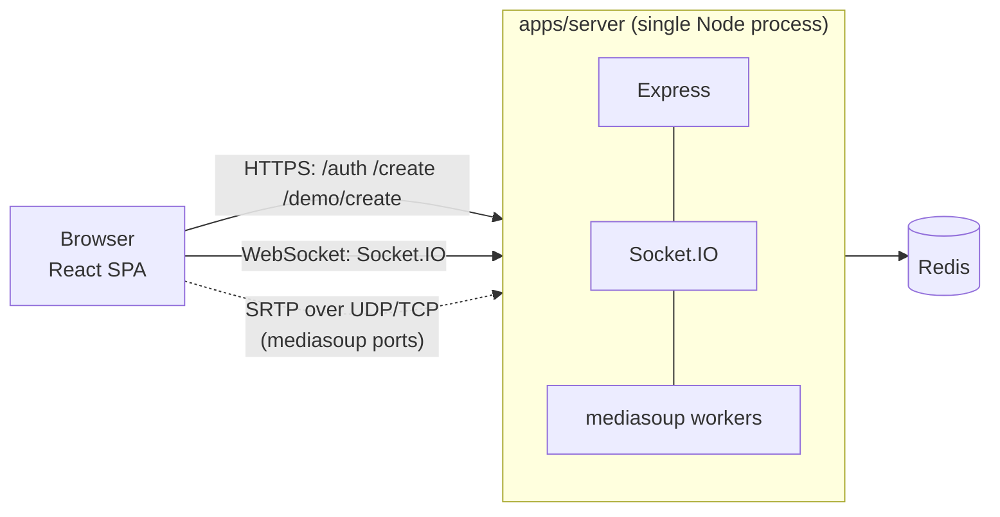

# MeetWave

A video-meeting application: sign in (or join as a guest), create a room, and meet over WebRTC with chat, reactions, a waiting room and host controls. Media is relayed through a [mediasoup](https://mediasoup.org/) SFU, so every participant uploads one stream and the server fans it out.

This repository is a pnpm monorepo with two apps:

| App | Path | What it is | Docs |
|---|---|---|---|
| **Server** (`meetapp-server`) | [`apps/server`](apps/server) | Express + Socket.IO + mediasoup + Redis (Node.js ≥ 24, TypeScript) | [README](apps/server/README.md) |
| **UI** (`meetwave-client`) | [`apps/ui`](apps/ui) | React 18 + Vite + MUI + Zustand SPA | [README](apps/ui/README.md) |

## Features (as implemented)

- Email and password accounts. Tokens are httpOnly cookies, and refresh tokens are single-use.
- Guest join with a room code, and "demo" rooms created without an account.
- Two room modes: `conference` (everyone can publish) and `broadcast` (only the host publishes, others are viewers).
- Optional room password, room lock with a **waiting room** (host admits or denies), participant cap (default 50).
- Host controls: lock/unlock, remove a participant, mute one or all, disable all cameras, end the meeting.
- In-room chat (last 100 messages kept), typing indicators, emoji reactions, active-speaker highlight, grid/spotlight layout, pinning.
- Clock synchronisation between clients and the server.

Not implemented, although parts of the UI hint at it: recording, a meeting history/scheduling page, profile and settings pages, a separate screen-share stream. See the [UI known issues](apps/ui/docs/KNOWN_ISSUES.md).

## How it fits together



More detail: [docs/ARCHITECTURE.md](docs/ARCHITECTURE.md).

## Quick start (local development)

Prerequisites: Node.js 24+, pnpm 12.9.1 (the version pinned in `package.json`), and a Redis you can reach **with a password**.

```bash
# 1. install everything
pnpm install

# 2. configure the server (fill in every value; see docs/CONFIGURATION.md)
cp apps/server/.env.example apps/server/.env

# 3. configure the UI
cp apps/ui/.env.example apps/ui/.env
#    set VITE_API_URL to the server's URL, e.g. http://localhost:3001

# 4. run both apps
pnpm dev
```

`pnpm dev` runs `pnpm --parallel --filter ./apps/* dev`, which starts the server (`ts-node-dev`) and the UI (`vite`, <http://localhost:5173>) together.

The server will refuse to start until the required variables are valid. The checklist and the gotchas (for example, `REDIS_URL` is used as a **host name**) are in [docs/CONFIGURATION.md](docs/CONFIGURATION.md) and [docs/DEVELOPMENT.md](docs/DEVELOPMENT.md).

## Repository scripts

From the root `package.json`:

| Script | Command |
|---|---|
| `dev` | `pnpm --parallel --filter ./apps/* dev` |
| `test` | `echo "Error: no test specified" && exit 1` (no tests exist) |

Per-app scripts are listed in each app's README.

## Docker

`compose.yaml` defines two services:

- `server`: built from `apps/server/Dockerfile` (Node 24 slim, multi-stage), `network_mode: host`, healthcheck on `GET /health`.
- `redis`: `redis:7-alpine` with append-only persistence and a named volume.

The UI is not part of the compose file (`apps/ui/vercel.json` suggests it is deployed to Vercel). See [docs/DEPLOYMENT.md](docs/DEPLOYMENT.md), including the **networking caveats** that need verification before relying on it.

## Documentation map

| Doc | Audience |
|---|---|
| [docs/ARCHITECTURE.md](docs/ARCHITECTURE.md) | Everyone: system design and end-to-end flows |
| [docs/CONFIGURATION.md](docs/CONFIGURATION.md) | Everyone: all environment variables, which are used |
| [docs/DEVELOPMENT.md](docs/DEVELOPMENT.md) | Contributors: local setup, workflow, conventions |
| [docs/DEPLOYMENT.md](docs/DEPLOYMENT.md) | Operators: Docker, ports, reverse proxy, cookies, UI hosting |
| [docs/SECURITY.md](docs/SECURITY.md) | Reviewers and operators: auth model, threat notes, open risks |
| [docs/TROUBLESHOOTING.md](docs/TROUBLESHOOTING.md) | Anyone stuck: symptom → cause → fix |
| [docs/KNOWN_ISSUES.md](docs/KNOWN_ISSUES.md) | Maintainers: prioritised summary of verified problems |
| [CONTRIBUTING.md](CONTRIBUTING.md) | Contributors |
| Server: [API](apps/server/docs/API.md) · [Socket events](apps/server/docs/SOCKET_EVENTS.md) · [Data model](apps/server/docs/DATA_MODEL.md) · [Architecture](apps/server/docs/ARCHITECTURE.md) | Backend |
| UI: [Architecture](apps/ui/docs/ARCHITECTURE.md) · [State](apps/ui/docs/STATE_AND_DATA.md) · [Realtime client](apps/ui/docs/REALTIME_CLIENT.md) · [Components](apps/ui/docs/COMPONENTS.md) | Frontend |

## Repository layout

```
.
├── apps/
│   ├── server/            Backend (see apps/server/README.md)
│   └── ui/                Frontend (see apps/ui/README.md)
├── docs/                  Cross-cutting documentation (this index)
├── compose.yaml           server + redis
├── package.json           Workspace root (private), `dev` script, pnpm 12.9.1
├── pnpm-workspace.yaml    packages: apps/*; allowBuilds: esbuild, mediasoup, protobufjs
└── pnpm-lock.yaml
```

## License

`package.json` declares `"license": "ISC"`, but the repository contains no `LICENSE` file. <!-- TODO: confirm the intended license and add a LICENSE file -->
