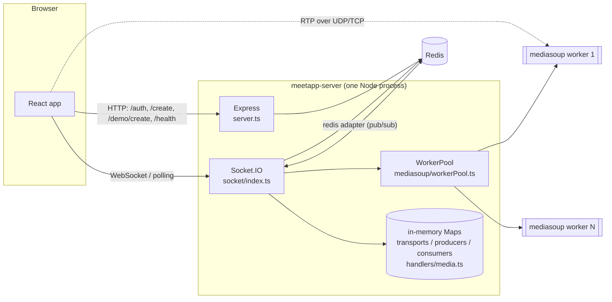

# Server Architecture

How `meetapp-server` is put together. For the system as a whole (UI + server + Redis + browser), see the [root architecture doc](../../../docs/ARCHITECTURE.md).

## Overview

One Node.js process hosts three things on a single `http.Server`:

1. an **Express** app (REST: health, room creation, auth),
2. a **Socket.IO** server (all meeting interaction), and
3. a pool of **mediasoup workers**, separate native processes that forward audio and video.

Redis holds all state that is not a live media object. mediasoup objects (workers, routers, transports, producers, consumers) live only in this process's memory.

## Startup sequence (`bootstrap` in `src/server.ts`)

1. `import "dotenv/config"`, then `config/index.ts` validates `process.env` with Zod. Any failure prints the field errors and calls `process.exit(1)`.
2. `connectRedis()` is called (not awaited). It connects `redis`, then starts `redisPub` and `redisSub`.
3. `workerPool.init()` creates `MEDIASOUP_WORKER_COUNT` workers (default 4), one at a time.
4. Express middleware is attached, in order: `express.json()`, `pino-http`, `cors`, `cookie-parser`.
5. Routes: `GET /health`, `POST /create`, `POST /demo/create`, `/auth` router, then a 404 fallback.
6. `createSocketServer(httpServer)` attaches Socket.IO, the Redis adapter, `socketMiddleware`, and the per-connection handlers.
7. The server listens on `127.0.0.1:PORT`.
8. Signal handlers: `SIGTERM`/`SIGINT` close the HTTP server, destroy the main Redis client and `process.exit(0)`. `uncaughtException` and `unhandledRejection` are logged and the process keeps running.

## Modules and responsibilities

| Module | Responsibility |
|---|---|
| `config/index.ts` | Single validated `config` object (see [Configuration](../../../docs/CONFIGURATION.md)) |
| `config/mediasoup.ts` | Worker settings, router codecs (Opus audio, VP8 and H264 video), WebRTC transport options, ICE server list |
| `mediasoup/workerPool.ts` | Creates workers, restarts a worker that dies, assigns each room's `Router` to a worker round-robin, exposes `getRouter`, `getOrCreateRouter`, `closeRouter`, `getWorkerStats` |
| `redis/roomRepository.ts` | Every Redis read and write for rooms, participants, chat, waiting list, producers |
| `routes/auth/*` | Account endpoints and user persistence |
| `middleware/authenticate.ts` | JWT creation and verification, refresh-token store and rotation |
| `middleware/cookies.ts` | Cookie names and options |
| `middleware/index.ts` | `requireAuth` for HTTP and `socketMiddleware` for the Socket.IO handshake |
| `socket/handlers/room.ts` | Join, leave, waiting room, lock, end, kick |
| `socket/handlers/media.ts` | Transport, produce and consume signalling and per-socket media bookkeeping |
| `socket/handlers/chat.ts` | Chat, typing, reactions, time sync, host moderation broadcasts |
| `socket/handlers/guards.ts` | `requireHost` and the `host:<roomId>` room-name helper |

## Key flows

### A. Create a room and join it as host

1. UI: `POST /create` with the auth cookie and `{ name, mode, isLocked, password, maxParticipants }`.
2. `requireAuth` sets `req.userId`. The handler loads the user, builds `RoomMeta` (`hostId` = user id), and calls `createRoom`, which runs `HSET room:oak-river-42 …`, `EXPIRE … 14400` and `ZADD rooms:active` in one transaction. Response `{ "roomId": "oak-river-42" }`.
3. UI opens a socket with `auth: { roomId: "oak-river-42" }`. `socketMiddleware` finds the cookie, sets `socket.data.id = <user id>`.
4. UI emits `room:join`. `handleJoin` sees `id === room.hostId` → `isHost = true`, so lock and password checks do not apply to the host. `joinRoom` assigns role `host` (conference) or `broadcaster` (broadcast), runs `addParticipant`, and joins both `oak-river-42` and `host:oak-river-42`.
5. The ack includes `rtpCapabilities` from `workerPool.getOrCreateRouter("oak-river-42")`. That call picks the next worker round-robin and creates the router on first use.

### B. Publishing and subscribing to media

1. The client creates a **send** transport: `transport:create` → `router.createWebRtcTransport({...webRtcTransportOptions, appData: { direction }})`. The transport is stored in `socketTransports[socket.id]`.
2. The client's transport fires `connect` → `transport:connect` → `transport.connect({ dtlsParameters })`.
3. The client produces a track → `produce` → `transport.produce(...)`. The server stores the `Producer` in memory, writes producer info to `room:{id}:producers`, and emits `new:producer` to the others.
4. Each other client, on `new:producer`, emits `consume` with its device's `rtpCapabilities`. The server runs `router.canConsume(...)`, finds the socket's `recv` transport, and creates a **paused** consumer. The client builds its consumer from the returned params, then emits `consumer:resume`.

### C. A participant leaves or loses connection

`disconnect` → `cleanupSocketMedia(socket.id)` closes producers, consumers and transports → `handleLeave`:
waiting-room cleanup → claim `socket.data.roomId` synchronously (so `room:leave` and `disconnect` cannot both proceed) → leave Socket.IO rooms → unregister the producers in Redis → `removeParticipant` → `participant:left` only if the removal succeeded → close the router if no participants remain.

### D. Host ends the meeting

`room:end` deletes all Redis keys of the room first (`deleteRoom`), closes the router, acks, emits `room:ended`, then disconnects every socket. Because the participant records are already gone, the resulting `handleLeave` calls announce nothing.

## Scaling model and limits

What the code supports:

- **Socket.IO events across instances.** The Redis adapter lets `io.to(room).emit(...)` and `io.in(socketId).fetchSockets()` reach sockets on other server instances.
- **Room state in Redis**, so any instance can read it.

What it does **not** support (read from the code and its own comments):

- mediasoup `Router`s and all `Transport`/`Producer`/`Consumer` objects are in process memory (`workerPool.routers`, `handlers/media.ts` maps). `handlers/media.ts` says so explicitly: "These are process-local; in multi-server you'd proxy, but for single-process this is fine". Two instances would not share a room's media. A client whose socket lands on another instance gets `ROUTER_NOT_FOUND` for `transport:create` (`getRouter` only reads the local map).
- Room metadata records `serverId` (hostname), but nothing routes by it.
- Consequence: run **one** server process per deployment unless you add sticky room-to-instance routing yourself.

## Design decisions evidenced in the code

| Decision | Evidence |
|---|---|
| Room is fixed by the handshake, never by the join payload | Comment in `handleJoin`: trusting a payload `roomId` would let a socket authorised for one room join another |
| One idempotent exit path for leaving | Comments in `socket/index.ts` and `handleLeave`; `removeParticipant` returns the record only to the caller that deleted it |
| Join attempts are serialised per socket | `joinChain` promise chain in `registerRoomHandlers` |
| Host-only broadcasts use a separate Socket.IO room | `hostRoom()` in `guards.ts`, used for waiting-room events |
| Stale duplicate sessions of the same user are replaced | `evictStaleSessions` in `room.ts` |
| Single-use refresh tokens with theft detection | `rotateRefreshToken` in `authenticate.ts` |
| Consumers start paused and the client resumes them | `paused: true` in the `consume` handler |
| Timing-safe login | `DUMMY_HASH` in `authRoutes.ts` |
