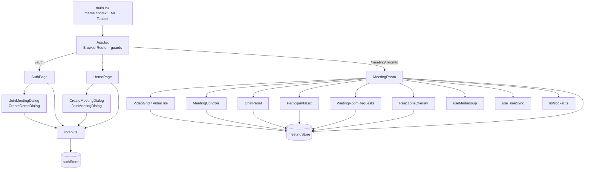

# UI Architecture

For the whole system (UI, server, Redis, media path), see the [root architecture doc](../../../docs/ARCHITECTURE.md).

## Overview

A client-side-rendered React 18 SPA. There is no server-side rendering and no data-fetching library: HTTP goes through one small `fetch` wrapper (`src/lib/api.ts`), and everything in a meeting goes through one shared Socket.IO connection (`src/lib/socket.ts`) plus mediasoup-client transports. Application state is held in two Zustand stores.

## Boot sequence

1. `index.html` loads `/src/main.tsx`.
2. `main.tsx` renders `<Root/>`, which holds the light/dark mode in `useState` (starts `"dark"`) and provides it through `ThemeModeContext` (`useThemeMode()`). It wraps `<App/>` in MUI `ThemeProvider` + `CssBaseline` and mounts a `react-hot-toast` `<Toaster/>`. React `StrictMode` is deliberately not used (the wrapping call is commented out).
3. `App.tsx` calls `useAuthStore().initAuth()` once. While `loading` is true it shows a spinner.
4. `initAuth` calls `GET /auth/me` through `apiFetch`. On 401 the client silently refreshes the session once and retries (see [STATE_AND_DATA.md](STATE_AND_DATA.md)). The result sets `user` (or `null`) and `loading=false`.
5. `BrowserRouter` renders the matching route.

## Routing (active router: `src/App.tsx`)

| Path | Element | Guard | Behaviour |
|---|---|---|---|
| `/auth` | `AuthPage` | `GuestGuard` | If signed in, redirects to the page the user was heading to (`location.state.from`) or `/` |
| `/` | `HomePage` | `AuthGuard` | If signed out, redirects to `/auth` and remembers where the user was heading |
| `/meeting/:roomId` | `MeetingRoom` | **none** | Reachable by guests. The server decides whether they may join |
| `*` | redirect to `/` | | |

`src/routes/index.tsx` defines a second router (`createBrowserRouter`) with `AppLayout`, `/meetings`, `/profile` and `/support`. **Nothing imports it**, so those pages are unreachable in the running app. See [COMPONENTS.md](COMPONENTS.md).

## User journeys

**Signed-in host**
1. `/auth` → sign in (`AuthPage` → `lib/authApi.login`) → `/`.
2. `HomePage` → "New meeting" → `CreateMeetingDialog` → `POST /create` → navigate to `/meeting/<roomId>`.

**Guest joining**
1. `/auth` → "Join" → `JoinMeetingDialog`: room code, optional password, display name. It stores the name in `localStorage["displayName"]` and navigates to `/meeting/<code>?pw=<password>`.
2. `MeetingRoom` connects the socket without a login cookie. The server gives the guest a random identity.

**Demo host (no account)**
1. `/auth` → `CreateDemoDialog` → `POST /demo/create` with a `displayName`.
2. The returned `userId` is saved in `sessionStorage["demoUser"]`. `MeetingRoom` sends it as `auth.demoUserId` in the socket handshake, which makes this browser tab the host.

## Theming

`src/theme/index.ts` exports `darkTheme` (also the default export) and `lightTheme`, which share color tokens (primary indigo `#6366F1`, secondary emerald `#10B981`) and the font stack `"Sora", "DM Sans", "Helvetica", sans-serif`. Mode toggling lives in `main.tsx`. `HomePage` consumes it through `useThemeMode`. The toaster style adapts to the mode.

## Build and dev configuration (`vite.config.ts`)

| Setting | Value |
|---|---|
| Alias | `@` → `./src`. The code mostly uses relative imports |
| Dev server | port `5173`, `allowedHosts: [".ngrok-free.app"]` |
| Dev proxy | `/socket.io` → `http://localhost:3001` (with `ws: true`) |
| Build | esbuild `pure` for `console.log`/`console.debug`/`console.info`, `drop: ["debugger"]` (applied only on `vite build`) |

The socket client connects straight to `VITE_API_URL`, not through the dev proxy, unless `VITE_API_URL` points at the Vite dev server itself.

## Cross-cutting design decisions evidenced in the code

| Decision | Where / evidence |
|---|---|
| Tokens live only in httpOnly cookies; the client never sees them | `api.ts` uses `credentials: "include"`; `authApi.ts` comment |
| Refresh runs once per tab at a time **and** serialised across tabs with the Web Locks API | `doRefresh` in `lib/api.ts`. Refresh tokens are single-use, and two tabs presenting the same one would be treated as theft by the server |
| Listeners read the store with `useMeetingStore.getState()` instead of captured values | `getStore()` in `MeetingRoom.tsx`: comment explains stale snapshots |
| Every socket listener is registered through one helper so teardown removes exactly those | `on()` and `listenersRef` in `MeetingRoom.tsx` |
| Participants and streams are matched by **socket id**, not user id | Comments in `MeetingRoom.tsx`: one account in two tabs shares a user id |
| Room fixed by the socket handshake | `connectSocket(roomId, …)` in `lib/socket.ts`. The server ignores any room in the join payload |
