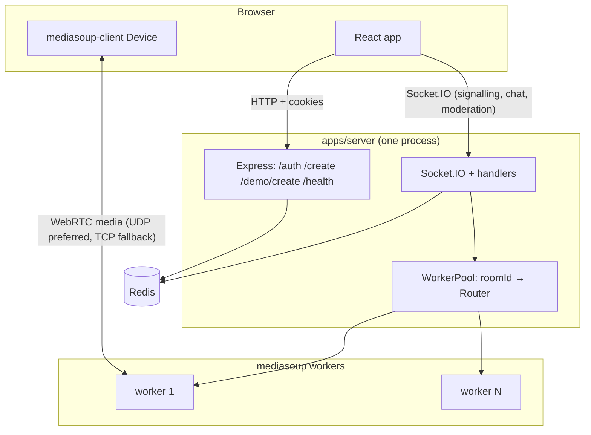
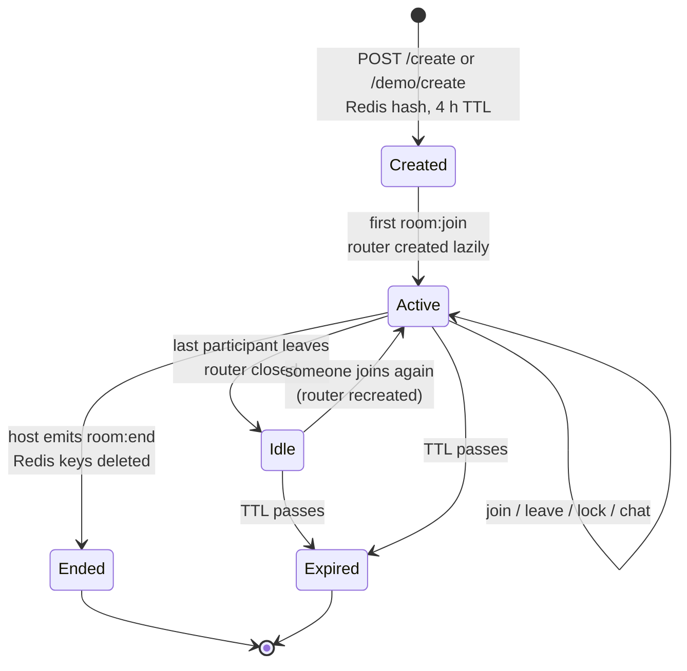

# System Architecture

This is the whole-system view. Per-app internals: [server](../apps/server/docs/ARCHITECTURE.md), [UI](../apps/ui/docs/ARCHITECTURE.md).

## 1. Context

MeetWave has three runtime parts plus the user's browser:

| Part | Technology | Responsibility |
|---|---|---|
| **UI** | React SPA (static files) | Screens, local capture of camera/mic/screen, WebRTC client (`mediasoup-client`) |
| **Server** | One Node.js process: Express, Socket.IO, mediasoup | Accounts, room creation, meeting protocol, media relay |
| **mediasoup workers** | Native child processes spawned by the server | Forward RTP between participants (SFU) |
| **Redis** | Redis 7 | Users, sessions, rooms, participants, chat, producer registry, Socket.IO adapter pub/sub |

Two separate network paths exist, and they fail independently:

1. **Signalling path**: HTTP and WebSocket to the server's single port (default `3001`, bound to `127.0.0.1`, so a reverse proxy sits in front).
2. **Media path**: UDP/TCP directly to mediasoup's WebRTC transports. The server advertises `ANNOUNCED_IP` as the address clients must send media to, and the media ports are a separate range (see [DEPLOYMENT.md](DEPLOYMENT.md)).

## 2. Identity model

| Who | How identified | Notes |
|---|---|---|
| Registered user | `access_token` cookie → JWT `sub` = user id | Stored in Redis (`user:{id}`) |
| Guest | No cookie. The server generates a random UUID per socket connection | Name from the join form, or `Guest-xxxx` |
| Demo host | `userId` returned by `POST /demo/create`, sent as `auth.demoUserId` | The browser keeps it in `sessionStorage` |

A *participant* is identified inside a meeting by its **socket id**. The user id can appear twice (two tabs). The server then evicts the older session (`room:replaced`).

## 3. Room lifecycle

All room keys carry a four-hour TTL, refreshed by some writes. See the [data model](../apps/server/docs/DATA_MODEL.md) and the TTL caveat in [KNOWN_ISSUES.md](KNOWN_ISSUES.md).

## 4. End-to-end trace: from clicking "New meeting" to seeing a second participant's video

Participants: **Ada** (signed in, host) and **Bo** (guest). Room code `oak-river-42`.

1. **Ada creates the room.** UI (`CreateMeetingDialog`) → `POST {API}/create` with `{name, mode:"conference", isLocked:false, maxParticipants:50}` and her cookies. Server (`server.ts`) loads her user, generates the code, writes `room:oak-river-42` + `rooms:active`. Response `{"roomId":"oak-river-42"}`. UI navigates to `/meeting/oak-river-42`.
2. **Ada connects.** `MeetingRoom` calls `connectSocket("oak-river-42", "Ada")`. The handshake carries her cookie. `socketMiddleware` verifies it and sets `socket.data.id = <Ada's user id>`.
3. **Ada joins.** `room:join` → she is the host (`id === room.hostId`), role `host`. The ack returns `rtpCapabilities` (router created on demand), no other participants, and no chat history.
4. **Ada publishes.** Device loaded, send and recv transports created (`transport:create` ×2, `transport:connect` as the transports connect). `getUserMedia`, then `produce` for audio and video. The server records both producers in `room:oak-river-42:producers`.
5. **Bo joins.** Bo enters the code in the join dialog (name "Bo" saved to `localStorage`) → `/meeting/oak-river-42`. Handshake without cookie: random user id, name "Bo". `room:join` → not host, room unlocked, no password, capacity fine → role `participant`. Ada's client receives `participant:joined`. Bo's ack lists Ada as a participant and her two producers.
6. **Bo subscribes.** For each of Ada's producers, Bo emits `consume`. The server checks `router.canConsume`, creates a paused consumer on Bo's recv transport, returns its parameters. Bo's client builds the consumer, puts the track in a `MediaStream` in `meetingStore.remoteStreams[AdaSocketId]`, and emits `consumer:resume`. Video flows: Ada → worker → Bo.
7. **Bo publishes** the same way. Ada receives `new:producer` for each of Bo's tracks and runs the same `consume` sequence.
8. **Chat.** Bo emits `chat:send {text:"hi"}`. The server pushes it to `room:oak-river-42:chat` (keeping 100) and emits `chat:message` to everyone in the room, including Bo.
9. **Leaving.** Bo closes the tab. `disconnect` closes his media objects and runs the idempotent leave. Ada receives `participant:left` and removes his tile.

## 5. Technology and responsibility boundaries

| Concern | Lives in | Not in |
|---|---|---|
| Persistent data | Redis | Server memory (except live media objects) |
| Meeting authorisation | Server (`socketMiddleware`, `requireHost`, `handleJoin`) | UI. UI checks are convenience only |
| Media routing | mediasoup workers inside the server host | Redis (only records producer *metadata*) |
| Moderation effects (mute etc.) | Client (receiving side) | Server (it only relays the request) |
| Time source for meeting timer | Server clock, offset estimated in the client (`useTimeSync`) | |

## 6. Scalability and operational limits

- **One server process per deployment.** mediasoup routers and all transports/producers/consumers are in memory. Socket.IO would span instances through the Redis adapter, but a room's media cannot. See [the server doc](../apps/server/docs/ARCHITECTURE.md#scaling-model-and-limits).
- **Worker count:** `MEDIASOUP_WORKER_COUNT` (default 4). Each new room's router is placed on the next worker round-robin.
- **Media port range** is hard-coded to 10000–10100 (101 ports) in `config/mediasoup.ts`, regardless of `MEDIASOUP_MIN_PORT` / `MAX_PORT`.
- **ICE servers** are hard-coded (Google STUN, public `freestun.net` TURN). Use your own TURN for anything beyond testing (see [SECURITY.md](SECURITY.md)).
- **Participant cap** per room defaults to 50, set at creation, enforced on join.
